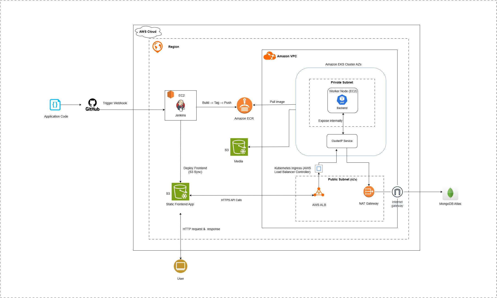
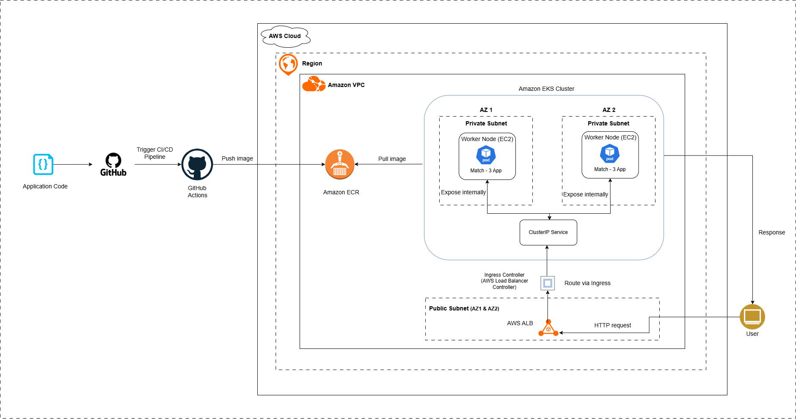
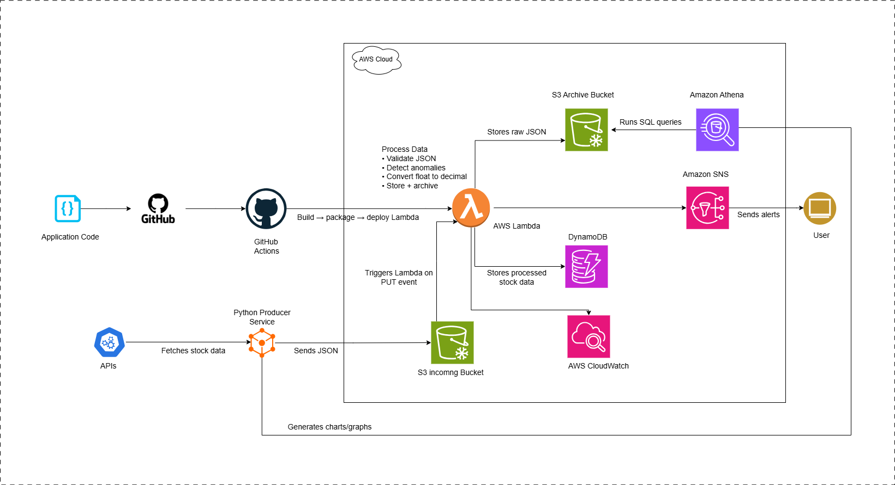
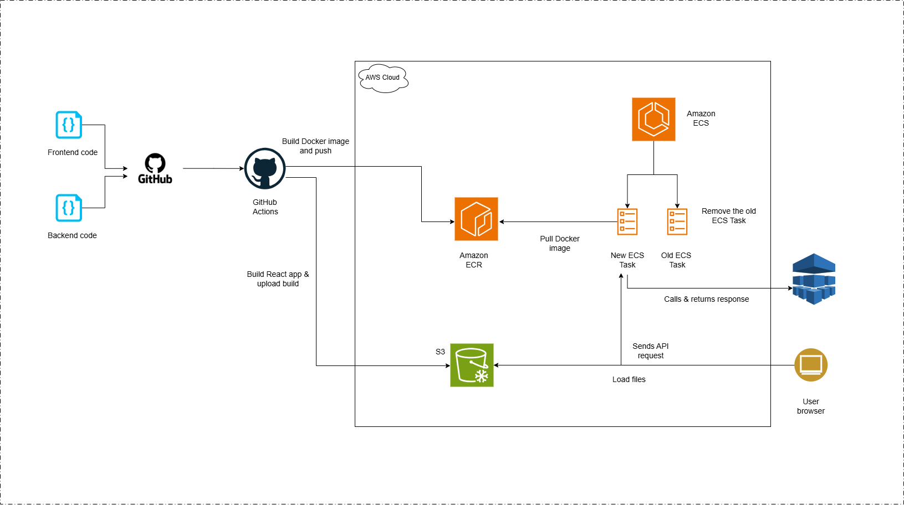

<h1 align="center">Hi 👋, I'm Sasun Madhuranga</h1>
<h3 align="center">🚀 Full-Stack Engineer | ☁️ Cloud & DevOps | 🤖 AI Builder</h3>

  

---

## 🧠 About Me

💡 AI-driven Full-Stack Developer from Sri Lanka 🇱🇰
⚡ I build **production-grade cloud systems**, not just demos
☁️ Strong focus on **AWS, Kubernetes, and scalable architectures**
🎯 Goal: Become a **Cloud/DevOps Engineer**

---

## 🚀 Featured Projects

---

📸 Cloud-Native Instagram Clone (AWS EKS + MERN + CI/CD)

🔹 Architecture
S3 (Frontend) → ALB (Ingress) → EKS (Backend) → MongoDB Atlas

🔹 CI/CD Flow

GitHub → Jenkins → Docker → ECR → EKS 

GitHub → Jenkins → S3 (Frontend)

🔹 Key Features

✔️ Full-stack social media platform

✔️ Kubernetes-based deployment with ALB Ingress

✔️ CI/CD automation using Jenkins + GitHub Webhooks

✔️ Dockerized backend with ECR integration

✔️ Infrastructure as Code using Terraform

✔️ Media storage using S3

🔸 Architecture Diagram

---

### 🎮 Cloud-Native Match-3 Game (EKS + Kubernetes + CI/CD)

🔹 **Architecture Highlights**

* Multi-AZ Kubernetes deployment (Amazon EKS)
* ALB Ingress with AWS Load Balancer Controller
* CI/CD pipeline with GitHub Actions → ECR → EKS
* IAM Roles for Service Accounts (IRSA with OIDC)

🔹 **Impact**
✔️ High availability & fault tolerance
✔️ Automated deployments
✔️ Production-like debugging experience

🔸 **Architecture Diagram**

---

### 📊 Real-Time Stock Data Pipeline (Serverless AWS)

🔹 **Architecture**
S3 → Lambda → DynamoDB → SNS → Athena

🔹 **Key Features**
✔️ Event-driven pipeline
✔️ Real-time anomaly detection
✔️ Serverless & scalable design

🔸 **Architecture Diagram**

---

### 🤖 AI German Learning Chatbot

🔹 **Stack**
React + FastAPI + Docker + ECS Fargate

🔹 **Features**
✔️ AI-powered responses (LLM)
✔️ Grammar correction (LanguageTool)
✔️ CI/CD automated deployment

🔸 **Architecture Diagram**

---

---

### 🌐 MERN Volunteer Platform (Web + Mobile)

🔹 **Highlights**
✔️ Role-based access system
✔️ QR-based attendance tracking
✔️ Certificate generation

---

## 🏗️ Architecture & DevOps Focus

  

💡 I specialize in:

* Designing **scalable distributed systems**
* Building **CI/CD pipelines**
* Deploying **containerized applications**
* Troubleshooting **real-world cloud issues**

---

## 🛠️ Tech Stack

---

## 📊 GitHub Analytics

  
  

  

---

## 🎥 Project Demos

  <a href="https://drive.google.com/file/d/1J6ZxjWaSYpL3IrO8ECzK0_fkupN0CQtb/view?usp=sharing">MERN Volunteer Platform (Web + Mobile) 1</a> 
  <a href="https://drive.google.com/file/d/1DtJnhXVIP3SIMmb_wwvptmGdCPkgVgaX/view?usp=sharing">MERN Volunteer Platform (Web + Mobile) 2</a> 
  <a href="https://drive.google.com/file/d/1AYbyysbFUhmPMqeTAFs1364yT-vPPIzn/view?usp=sharing">Cloud-Native Match-3 Game (EKS + Kubernetes + CI/CD)</a> 
  <a href="https://drive.google.com/file/d/18dGopyfJ7VcxNxreOFfKYiP4diuAtbjj/view?usp=sharing">Real-Time Stock Data Pipeline</a> 
  <a href="https://drive.google.com/file/d/191b1qULHQAGC1c8OizygoQbK93F1qzSt/view?usp=sharing">AI German Learning Chatbot</a>

---

## 🌐 Connect With Me

  
  
  
  

---

## 🏆 Next Goals

* AWS Certifications
* Advanced Kubernetes
* Large-scale system design

---

## ⚡ Personal Motto

💡 *“Build it like it’s going to production.”*

---

  

